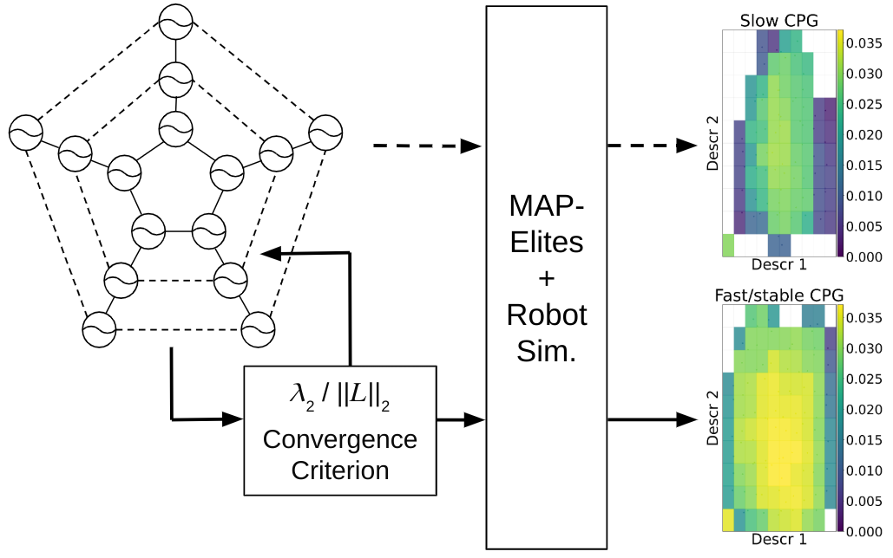

# Stability-Driven CPG Design for More Effective Quality-Diversity in Evolutionary Robotics

Code accompanying the paper:

**"Stability-Driven CPG Design for More Effective Quality-Diversity in Evolutionary Robotics"**  
Matthias Pex, Dries Marzougui, and Francis wyffels (Ghent University - imec - IDLAB-Airo)
Genetic and Evolutionary Computation Conference (GECCO '26)
https://doi.org/10.1145/3795095.3805096

**Abstract:**
Evolutionary robotics commonly employs quality‑diversity algorithms to discover diverse, high‑performing behaviours.
Meanwhile, central pattern generators provide a compact neural dynamical model for
robotic locomotion control.
Their differential-equation-based formulation induces smooth, rhythmic actions,
while also reducing the dimensionality of the search space.
However, the widely used Kuramoto-inspired central pattern generators
exhibit nonlinear dynamics, for which convergence depends sensitively on network
connectivity and coupling parameters.
When convergence is slow or unstable, controller evaluations become noisy,
which substantially degrades quality‑diversity performance.
This work introduces an analytical criterion to assess and guarantee the convergence properties of Kuramoto‑based central pattern generators prior to optimisation or simulation. The method yields principled guidelines for selecting connectivity structures and coupling strengths based on the eigenvalues of the Laplacian of the connectivity graph. Experiments on a simulated brittle star robot demonstrate that adhering to this criterion, significantly improves the efficiency and discovery of coordinated gaits. The criterion (a) predicts stable convergence from network structure alone, (b) enhances both the breadth and quality of exploration, and (c) scales naturally to morphologies of arbitrary complexity.

Researchers who want to use the brittle star environment for their own experiments,
are encouraged to use the implementation
available under the [Bio-inspired Robotics Testbed](https://github.com/Co-Evolve/brt).

**Important note:** This code is provided in a research form and is **not packaged as a polished software library**.
The source code that is used for generating, analysing and visualising the data is provided
for the interested reader and for the possibility of reproducing the results.

## Repository structure

* `cpg-qd/configs`: contains an example of a config file that can be used to launch experiments.
* `cpg-qd/scripts`: contains all the python code for generating and analysing data. Entire interaction with this repository's code can happen through these files.
* `cpg-qd/src`: The source code used in this project.  
    └ `biorobot`: adapatation of the [Bio-inspired Robotics Testbed](https://github.com/Co-Evolve/brt)  
    └ `cpg_convergence`: custom package with project specific source code. 
* `brittle_star/analysis`: contains the code used for analysing the neural dynamics and gait kinematics.

## Known Limitations
- This repository has grown organically and was not constructed with ease of reproducability in mind.
- Important defaults are grouped in the `src/cpg_convergence/defualt.py` script, but running experiments still requires insight into the methodology and manual finetuning via configuration scripts.
- Error handling is limited in some parts of the pipeline.
- The scripts are provided mainly for inspection and may require manual path adjustments.
- For optimal efficiency, GPU usage is recommended.

## Citation

TBA (bibtex format)

## License

This project is licensed under the MIT License. See `LICENSE` for details.
